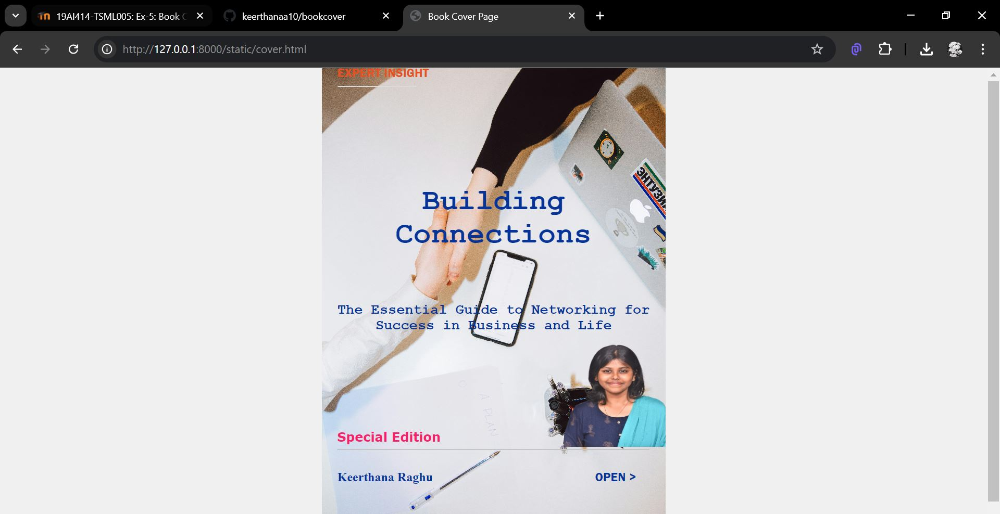

# Ex-5 Book Cover Design
## Date:17/10/2024

## AIM:
To design a book front cover page using HTML and CSS.

## DESIGN STEPS:

### Step 1:
Create a Django Admin project.

### Step 2:
Create an app in the Django interface.

### Step 3:
Create a folder named 'static' in the app folder.

### Step 4:
Create a new HTML file in the static folder.

### Step 5:
Write the HTML code with relevant CSS properties.

### Step 6:
Choose the appropriate style and color scheme.

### Step 7:
Insert the images in their appropriate places.

### Step 8:
Publish the website in the LocalHost.

## PROGRAM:
```
<!DOCTYPE html>
<html lang="en">
    <head>
        <meta name="viewport" 
        content="width=device-width, initial-scale=1.0">
        <style>
        body {
            display: flex;
            justify-content: center;
            align-items: center;
            height: 100vh;
            margin: 0;
            background-color: #f0f0f0;
        }

        .bookpage {
            width: 400px;
            height: 600px;
            color: rgb(5, 51, 152);
            padding: 20px;
            font-family: 'Franklin Gothic Medium', 'Arial Narrow', Arial, sans-serif;
            background-image: url(bgcover.jpg);
            background-size: cover;
        }
        .insight{
            color: rgb(227, 82, 34);
            top: 50px;
            left: 5px;
        }
        .hrstyle{
            width:100px;
        }
        .author{
            display: inline;
            position: relative;
            color: rgb(5, 51, 152);
            top:190px;
            font-family: 'Helvetica Neue';
            font-size: medium;
        }
        .booktitle{
            font-family: 'Helvetica Neue', Courier, monospace;
            font-size: 19px;
            text-align: center;
            position: relative;
            top: 100px;
        }
        .id {
            width:400px;
            position: relative;
            top:180px;
        }
        .pub{
            font-size: medium;
            position: relative;
            top:155px;
            left:330px;
        }
        .ed{
            color: rgb(246, 33, 108);
            font-size: medium;
            font-family: Verdana;
            position:relative;
            top:85px;
        }
        .subtitle{
            font-family:'Raleway', Courier, monospace;
            font-size: large;
            text-align: center;
            position: relative;
            top:140px;
        }
        .mypic{
            position: relative;
            top: 140px;
            left: 290px;
            width: 100px;
            height: 100px;
            background-size: cover;
        }
        </style>
        <title>Book Cover Page</title>
    </head>
    <body>
        <div class="bookpage">
            <div class="insight">EXPERT INSIGHT</div>
            <div class="hrstyle"><hr style="color: rgb(161, 186, 191);"></div>
            <div class="booktitle"><h1>Building Connections</h1></div>
            <div class="subtitle"><b>The Essential Guide to Networking for Success in Business and Life</b></div>
            <div class="mypic"></div>
            <div class="id"><hr style="color: rgb(222, 53, 216);"></div>
            <div class="author"><p><b> Keerthana Raghu</b></p></div>
            <div class="pub">OPEN ></div>
            <div class="ed"><b>Special Edition</b></div>
        </div>
    </bodY>
</html>

```

## OUTPUT:


## RESULT:
The program for designing book front cover page using HTML and CSS is completed successfully.
